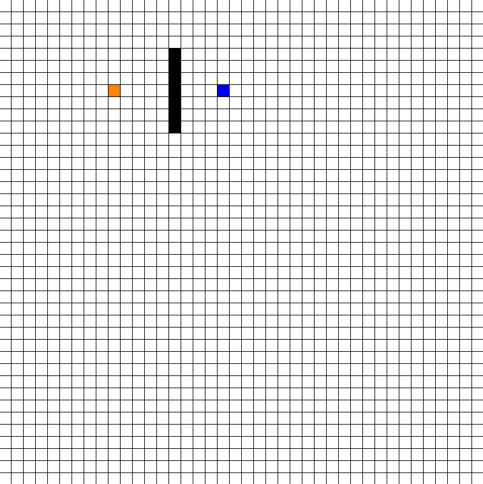

# Graph Visualizer

I am a visual learner who appreciates a visual representaion of any type of problem. In an attempt to furthur understand how tree data structures could be visualized,
I decided to create a visualizer that cemented my understanding of visualization.  

The Visualizer only includes Breadth-First Search, but it can be extended to include other graph searching algorithms

### Demo

# Dependencies
- pygame [pip install pygame]
